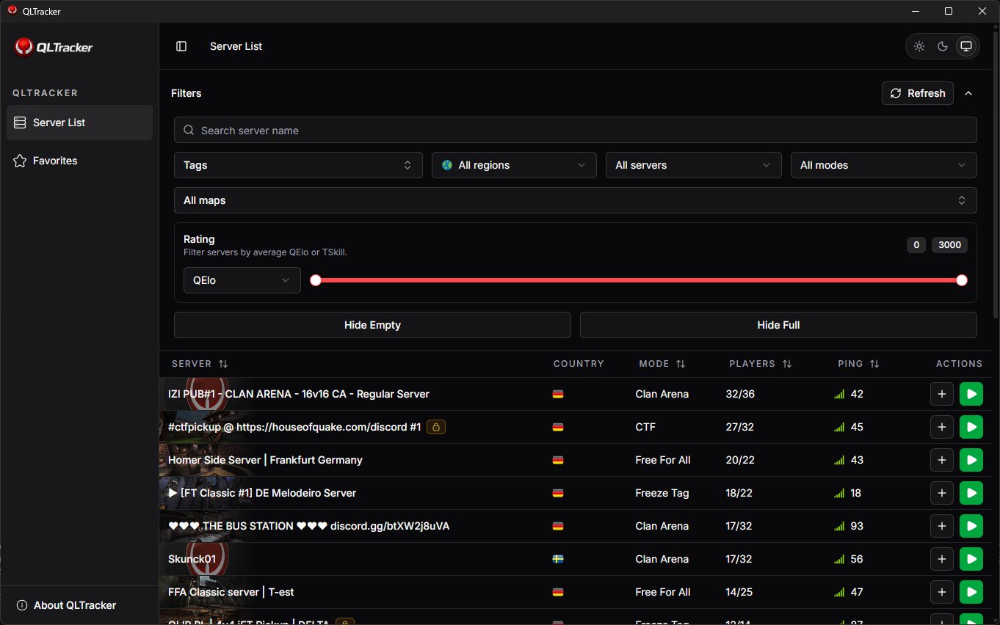

# QLTracker



Open-source Quake Live server browser built with Tauri, React, TypeScript, Tailwind v4, and `shadcn/ui`.

QLTracker combines Steam server discovery with qlstats and optional TrueSkill enrichment to provide a desktop-first Quake Live browser with favorites, player lookups, and self-updating releases.

## Features

- Live Quake Live server list from the Steam server browser API
- Quake Live focused filters:
  - search
  - region
  - public/private
  - game mode
  - tags
  - maps
  - hide empty / hide full
  - QElo / TSkill range filter
- Drawer-based server details
- Player list with:
  - points
  - time played
  - QElo
  - TSkill
  - qlstats profile links
- Favorites with custom favorite lists
- Saved passwords for private servers
- Direct join via Steam protocol
- Built-in updater splash window for packaged builds
- Light / dark / system theme support

## Stack

- Tauri 2
- React 19
- TypeScript
- Vite
- Tailwind CSS v4
- `shadcn/ui`
- TanStack Query
- TanStack Table
- Framer Motion

## Data sources

- Steam Web API
  - server discovery
- Steam A2S UDP queries
  - players
  - ping
  - password-required state
- qlstats
  - QElo and player profile enrichment
- qlrelax TrueSkill endpoint
  - optional TSkill enrichment
- Check-Host
  - server country lookup

## Requirements

- Node.js 20+
- Rust toolchain
- Tauri prerequisites for your platform
- Steam Web API key

Windows development also needs the standard Tauri desktop prerequisites installed.

## Development

Install dependencies:

```bash
npm install
```

Create a local env file:

```bash
cp .env.example .env.local
```

Run the desktop app:

```bash
npm run dev
```

Run only the web frontend:

```bash
npm run web
```

Build the frontend:

```bash
npm run build
```

See [CONTRIBUTING.md](CONTRIBUTING.md) for contribution workflow and PR expectations.

## Environment

Current env vars:

```env
VITE_QLSTATS_API_URL=https://qlstats.net/api
VITE_STEAM_API_KEY=your_steam_web_api_key
VITE_STEAM_APP_ID=282440
VITE_TRUESKILL_URL_TEMPLATE=http://qlrelax.freemyip.com/elo/bn/%s
```

Notes:

- `VITE_STEAM_API_KEY` is required for server discovery.
- `VITE_STEAM_APP_ID` defaults to `282440` if omitted.
- `VITE_QLSTATS_API_URL` should point to the qlstats API base.
- `VITE_TRUESKILL_URL_TEMPLATE` is optional. If unset, TSkill values may be unavailable.

## About config

About dialog metadata is stored in:

- [src/config/about.yml](src/config/about.yml)

That file controls:

- app name
- author
- description
- runtime label
- repo link
- social links

## Self-updater

Packaged builds use the Tauri updater plugin and start with a bootstrap splash window that:

1. checks GitHub Releases
2. downloads a newer build if available
3. installs it
4. restarts the app
5. opens the main window

Updater endpoint:

- `https://github.com/Splicho/QLTracker/releases/latest/download/latest.json`

The updater is configured in:

- [src-tauri/tauri.conf.json](src-tauri/tauri.conf.json)

## Signing

Tauri updater releases must be signed with the same private key every time.

This project currently uses a locally generated updater keypair. The public key is already embedded in Tauri config, and the private key must be available when building signed updater artifacts.

Typical environment variables for release signing:

```env
TAURI_SIGNING_PRIVATE_KEY_PATH=path/to/your/updater.key
TAURI_SIGNING_PRIVATE_KEY_PASSWORD=optional_password
```

If you lose the private key, existing installed apps will no longer trust future updates.

## Releasing

For self-updates to work:

1. bump the app version
2. build signed updater artifacts
3. publish the generated updater files to the same GitHub release

The repo is public, so no separate private release repository is required.

GitHub Actions now includes a release workflow:

- [.github/workflows/release.yml](.github/workflows/release.yml)

It runs on tags like `v0.1.0`, builds signed Windows NSIS updater artifacts, and publishes them to this repository's GitHub Release.

Required GitHub repository secrets:

- `TAURI_SIGNING_PRIVATE_KEY`
- `TAURI_SIGNING_PRIVATE_KEY_PASSWORD` (only if your updater key is password protected)

The workflow also verifies that the pushed tag matches the version in `package.json`.

## Repository structure

- `src/`
  - React frontend
- `src-tauri/`
  - Tauri desktop backend and config
- `src/config/about.yml`
  - About dialog metadata

## Known notes

- Country lookups are cached to avoid Check-Host rate limiting.
- QElo / TSkill enrichment depends on third-party endpoints and may be partially unavailable.
- Large map image imports make the frontend bundle heavier than ideal.

## License

MIT. See [LICENSE](LICENSE).
